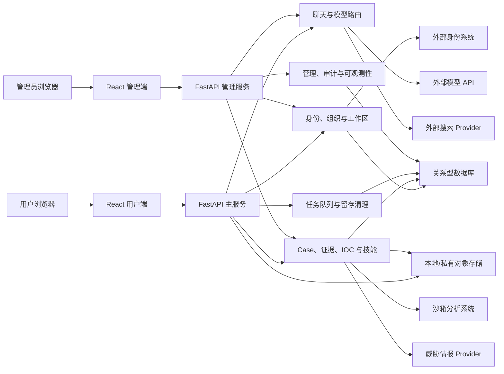

# Cipher Intelligence

Cipher Intelligence 是一个面向安全分析、团队协作和调查工作流的私有 AI 工作台。它把服务端多模型聊天、统一身份登录、组织与工作区、Case 调查、证据管理、威胁情报富化、技能执行、审计与管理后台整合在一起，让复杂分析工作可以沉淀为可追踪、可协作、可复核的流程。

This repository is maintained as a private project workspace. It is not intended for public distribution, public deployment documentation, or open-source reuse.

## 功能概览

- 服务端 AI 聊天：统一管理多模型通道、流式响应、附件、Web 搜索和模型路由。
- 身份与账号：通过外部身份系统接入 SSO，会话、账号资料与安全设置均由服务端控制。
- 组织与工作区：支持团队、成员、角色、工作区和组织级用量记录。
- Case 调查：围绕事件/样本/线索建立 Case，沉淀证据、评论、结论、报告和协作记录。
- 威胁情报：支持 IOC 提取、富化、批量处置和导出。
- 技能系统：把可复用分析流程封装为服务端技能，支持扫描、审查、运行和回滚。
- 管理后台：用于查看服务状态、模型配置、Prompt、邀请、留存、用量、审计和质量反馈。
- 审计与治理：记录关键操作，支持用量统计、保留策略和安全边界检查。

## 架构

## 私有仓库约定

不要提交以下内容：

- 生产密钥、API token、OAuth Client Secret、Session Secret。
- 真实域名、公网 IP、隧道 ID、机器名或部署路径。
- 私有部署脚本、服务配置、运维 runbook。
- 客户数据、样本原文、日志、导出的调查报告或截图。

配置示例只能使用占位值；生产配置应保存在部署环境或专用 Secret 管理系统中。
